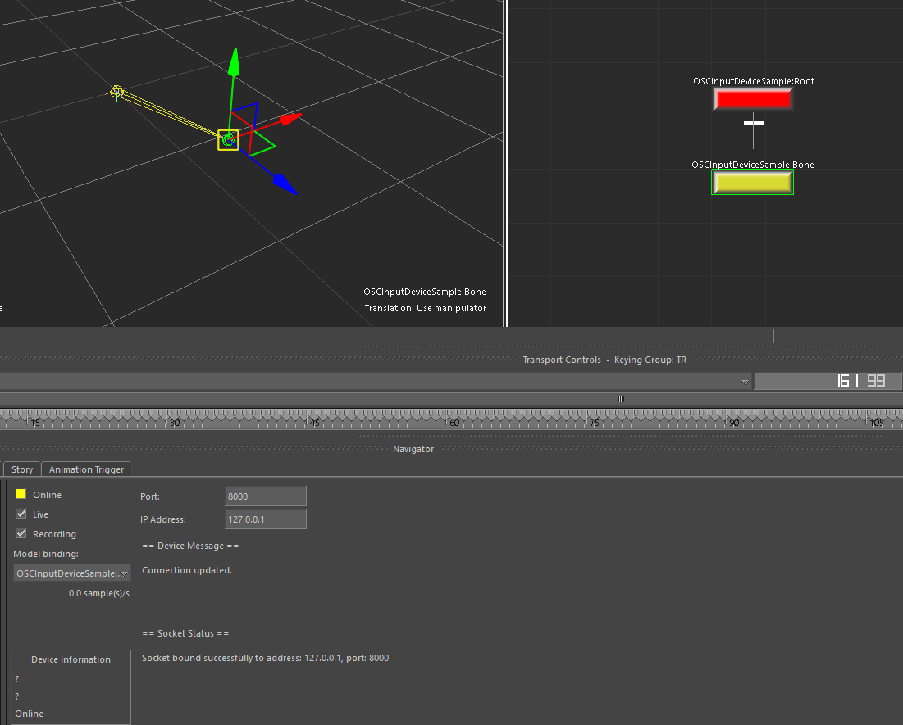

# Mobu - OSC Input Device Sample

This sample receives Open Sound Control (OSC) messages from a UDP socket and applies them to a single bone. This source uses the **oscpack library** for parsing OSC messages and the **Windows Sockets API (WSA)** for UDP communication.

<br>
<p align="center">
    
</p>
<br>

## How to Build
1. **Get and build the oscpack library**
   
   You can download the oscpack library source from [oscpack GitHub](https://github.com/RossBencina/oscpack).

<br>

2. **Set CMake variables in `CMakeLists.txt`**

    ```
    # === Environment-specific user configuration ===
    set(PRODUCT_VERSION 2026)
    set(OSC_PACK_ROOT "C:/oscpack_1_1_0/install")
    set(MOBU_ROOT "C:/Program Files/Autodesk/MotionBuilder ${PRODUCT_VERSION}")
    ```

    - `PRODUCT_VERSION`: The version of MotionBuilder
    - `OSC_PACK_ROOT`: The path to the oscpack library root directory
    - `MOBU_ROOT`: The path to the MotionBuilder installation directory

<br>

3. **Build the sample with CMake**
   
    ```
    cd OSCInputDeviceSample
    cmake -S . -B build -G "Visual Studio 17 2022"
    ```

    if Release build, run
    ```
    cmake --build build --config Release
    ```

    if Debug build, run
    ```
    cmake --build build --config Debug
    ```

    `OSCInputDeviceSample-<version>-MB<product version>.dll` will be built and copied to the `MotionBuilder <product version>/bin/x64/plugins` directory. If you need the debug information, please build with debug configuration and manually copy the `OSCInputDeviceSample-<version>-MB<product version>.pdb` file to the same directory.


<br>

## How to Use
This sample plugin will be built as `OSCInputDeviceSample-<version>-MB<product version>.dll` （and `OSCInputDeviceSample-<version>-MB<product version>.pdb` if debug）.

Place this file in the `MotionBuilder <product version>/bin/x64/plugins` directory.

<br>

## Note
- This project is licensed under the BSD 3-Clause License. Also includes the MIT-licensed library **oscpack** (see [LICENSE/oscpack/LICENSE.txt](/LICENSES/oscpack/LICENSE.txt))


- By default, this sample plugin assumes that the message format follows the [VMC (Virtual Motion Capture) Protocol](https://protocol.vmc.info/english).  

    See the link and [OSCInputDeviceSample_socket.cpp](./src/OSCInputDeviceSample_socket.cpp) for more details.
